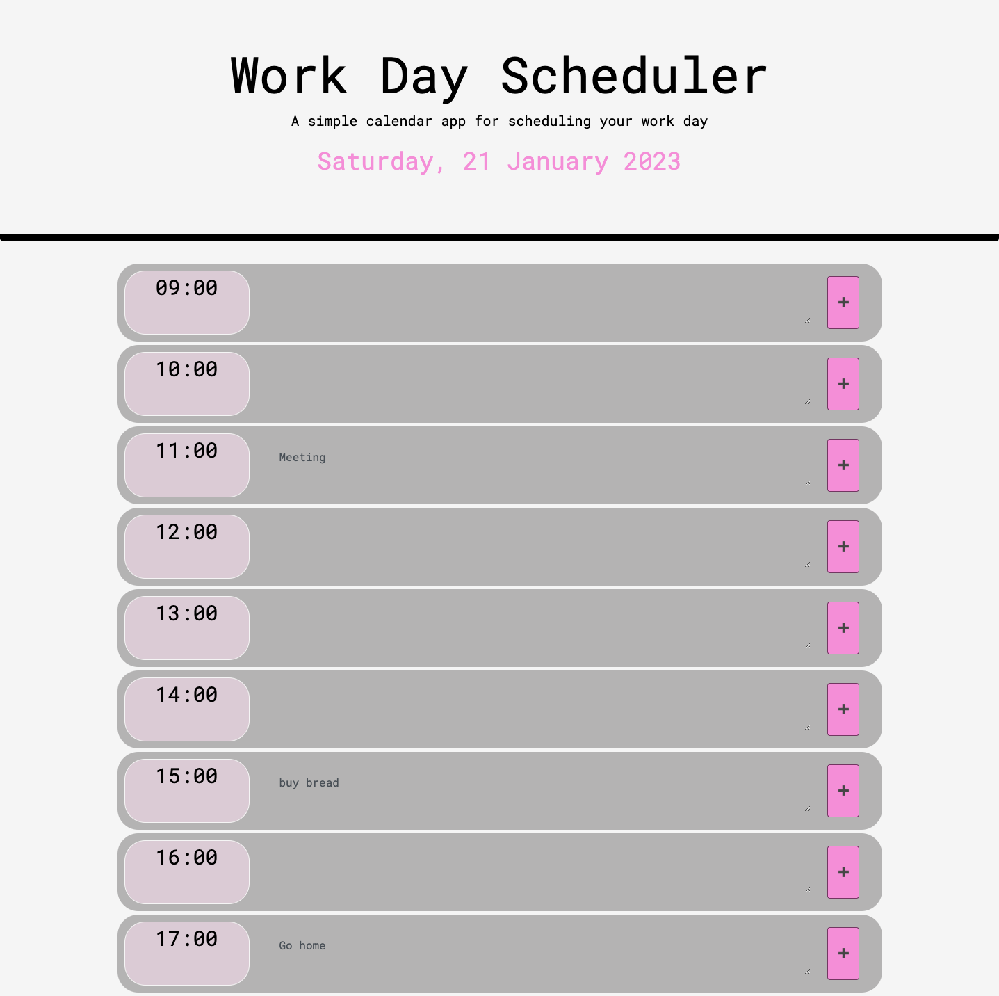

# Daily-Planner App

<a href="https://github.com/berta-rf/daily-planner-app/blob/main/LICENSE"></a>

## Table of contents

- [About the project](#about)
  - [User Story](#user-story)
  - [Screenshot](#screenshot)
  - [Links](#links)
- [My process](#my-process)
  - [Built with](#built-with)
  - [Useful resources](#useful-resources)
- [Author](#author)
- [License](#license)
- [Contributing](#contributing)

## About the project

This application is a simple calendar app that allows the user to save events for each hour of the day. This app runs in the browser, and features dynamically updated HTML and CSS powered by jQuery.

The app:

- Displays the current day at the top of the calendar when a user opens the planner.

- Presents timeblocks for standard business hours when the user scrolls down.

- Color-codes each timeblock based on past, present, and future when the timeblock is viewed.

- Allows a user to enter an event when they click a timeblock.

- Saves the event in local storage when the save button is clicked in that timeblock.

- Persists events between refreshes of a page.

### User Story

```md
AS AN employee with a busy schedule
I WANT to add important events to a daily planner
SO THAT I can manage my time effectively
```

### Screenshot



### Links

- Repository URL: [https://github.com/berta-rf/daily-planner-app](https://github.com/berta-rf/daily-planner-app)
- Live Site URL: [https://berta-rf.github.io/daily-planner-app](https://berta-rf.github.io/daily-planner-app)

## My process

### Built with

- jQuery
- Luxon
- JavaScript
- HTML
- CSS
- Bootstrap

### Useful resources

- [Luxon API docs](https://moment.github.io/luxon/api-docs/index.html#datetimenow)
- [Article on localStorage](https://blog.logrocket.com/localstorage-javascript-complete-guide/#howdoeslocalstoragework)
- [jQuery documentation on .data()](https://api.jquery.com/data/)

## Author

- Berta Romano Fernandez [bertaromanofernandez@gmail.com]
- GitHub - [berta-rf](https://github.com/berta-rf)
- LinkedIn - [Berta Romano Fernandez](https://www.linkedin.com/in/berta-romano-fernandez-85a51117a/)
- Frontend Mentor - [@berta-rf](https://www.frontendmentor.io/profile/)

## License

Distributed under the **MIT license**. See [`LICENSE`](LICENSE) for more information.

## Contributing

Contributions are what make the open source community such an amazing place to learn, inspire, and create. Any contributions you make are **greatly appreciated**.

If you have a suggestion that would make this better, please fork the repo and create a pull request. You can also simply open an issue with the tag "enhancement".
Don't forget to give the project a star! Thanks again!

1. Fork the Project
2. Create your Feature Branch (`git checkout -b feature/AmazingFeature`)
3. Commit your Changes (`git commit -m 'Add some AmazingFeature'`)
4. Push to the Branch (`git push origin feature/AmazingFeature`)
5. Open a Pull Request
